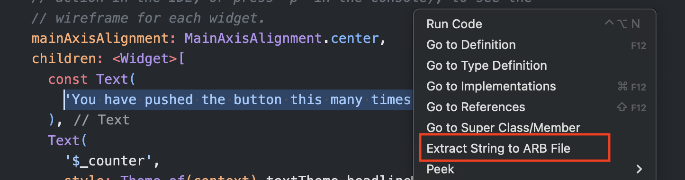
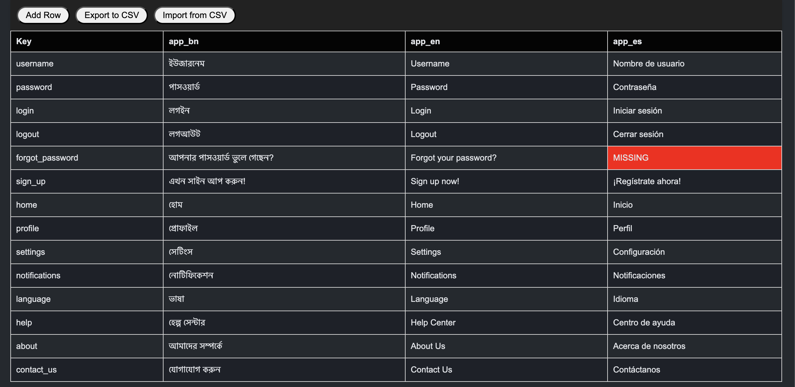

# ARB Manager - VSCode Plugin

_Extract Strings, View ARBs in Table and more..._

The **ARB Manager Plugin** helps the management of ARB (Application Resource Bundle) files, enabling developers to manage ARB files within a simple and intuitive interface.

## Features

### 1. Extract Hardcoded Strings to ARB Files

- Right-click any hardcoded text in your codebase and select **Extract String to ARB File**. It will replace the hardcoded string with l10n.your_entered_key, define l10n according to your project tech stack in a variable.

For example, in Flutter project if you are using `flutter_localizations` from flutter SDK, you can define—

```dart
final l10n = AppLocalizations.of(context);
```

Or you can make a build context extension to make it more cleaner. 😉

- On first use, locate your ARB files in the project folder. Use naming conventions like `app_en.arb` or `en.arb` for automatic locale detection.

<p style="padding: 24px">

</p>

Note: Translation doesn't occur automatically, you have to replace the strings manually follwoing your business requirement, auto translate may lead wrong translate, but we have a plan to add a flag if user wants auto translate in future.

** If you face issues with locating wrong arb folder or later at some point you decided to move ARB files on a different location, use `cmd` + `shift` + `p` and type `Clear ARB Folder Path` and try again to extract string, it will ask you again to select the correct ARB folder location.

### 2. View and Edit Translations

- Display all ARB files in a tabular format.
- Edit translations directly within the table.
- Highlight missing translations for easy identification.

<p style="padding: 24px">

</p>

### 3. Add New Translation Keys

- Add new keys dynamically, ensuring key uniqueness.
- Missing translations are highlighted automatically.

### 4. Import and Export Translations

- Import translations from a CSV file.
- Export current translations to a CSV file for external editing or backup.

## Usage

### Prerequisites

This plugin requires that ARB files are already set up in your project. You can then use ARB keys and classes to render strings on the UI.

### Steps to Use

#### 1. Extract Strings to ARB Files

- Select hardcoded text, right-click, and choose **Extract String to ARB File**.
- Locate ARB files when prompted on the first use.

#### 2. View ARB Files

- Locate an ARB file in the project explorer.
- Right-click and select **View ARB File** to open it in a table view.

#### 3. Edit Translations

- Click any table cell to edit its content.
- Changes save automatically when moving to another cell.

#### 4. Add New Keys

- Click **Add Row** to create a new translation key.
- Enter the key and translations, then click **Save** to confirm or **Cancel** to discard changes.

#### 5. Import and Export

- Use the **Import** button to upload a CSV file with translations.
- Use the **Export** button to download current translations as a CSV file.

## Contributing

Contributions are welcome! Follow these steps:

1. Fork the repository.
2. Create a new branch for your feature or bug fix.
3. Submit a pull request with a clear explanation of your changes.

> **Note:** Follow [Conventional Commit](https://www.conventionalcommits.org/) guidelines for PR titles and commit messages.

## License

This project is licensed under the [MIT License](LICENSE).
